# CleanMe

## 1. Introduction

CleanMe is an app designed to make it easier for users to connect with professional cleaners. It allows for quick and simple booking of cleaning services. Users can browse available cleaners, filter them by location, price, and services offered, and easily schedule an appointment. Once a booking is made, all communication remains within the app to ensure transparency and security. In case of cancellations or rescheduling, the system automatically records changes, helping cleaners manage their time and availability more efficiently.

## 2. Features

CleanMe includes the following features:

- **User Registration** – Two types of users can register: cleaner and client.
- **Post-registration for Cleaners** – After basic registration, cleaners can enter their services, hourly rates, working hours, and additional details.
- **Login System** – Secure login for both cleaners and clients, with redirection to their respective dashboards.
- **Client Dashboard** – Clients can search for cleaners using filters such as price, availability, location, and service type.
- **Cleaner Dashboard** – Cleaners can view incoming bookings, accept or decline requests, and update their information.
- **Search and Filtering** – Clients can filter cleaners based on services, working hours, location, and price, with an option to sort by price.
- **Cleaner Profiles** – Each cleaner has a profile card displaying key details, services, pricing, and buttons for booking or saving.
- **Booking Appointments** – Clients can book services by selecting a time, location, and adding comments.
- **Booking Notifications** – Cleaners receive requests that they can accept or decline, while clients get updates on their booking status.
- **Live Chat** – Communication between clients and cleaners is enabled but only within three days of the scheduled service to prevent off-app arrangements.
- **Cancellation and Rescheduling** – Clients can cancel an appointment, except within the last three days before the scheduled service.
- **Rating System** – After the service is completed, clients can rate the cleaner's work.
- **User Protection** – Terms & Conditions, as well as cancellation and rescheduling policies, are in place to ensure a fair and reliable service.
- **TO BE IMPLEMENTED: Secure Payments** – Integrated online payment system within the app to ensure transaction security.

## 3. Pages

CleanMe includes the following user interface pages:

- **Home Page** – The main page displaying basic information about the app.
- **Login Page** – Presents users with a form to log into their account.
- **Registration Page** – A page where clients or cleaners can create an account by entering basic information.
- **Dashboard** – A page conditionally rendered based on the type of user:
  - **User view**: Displays a list of available cleaners with search filters and sorting options.
  - **Cleaner view**: A space where cleaners can view their bookings, update their information, and manage client requests.
- **Profile Page** – Allows users/cleaners to update their details:
  - **Users**: Name, surname, profile picture, address.
  - **Cleaners**: Name, surname, profile picture, services offered, hourly rates, working hours.
- **Cleaner Page** – A detailed cleaner profile showing their services, prices, and ratings, with options for contact and booking. (Conditionally rendered)
- **Service Reservation Page** – A booking page where clients select the time, location, and leave a comment.
- **My Reservations Page** – A page where users can view their past and upcoming bookings, cancel them, or review details.
- **Notification Page** – Displays all important notifications related to bookings, accepted or declined requests, and ratings for cleaners.
- **Terms & Conditions Page** – A page containing the app’s terms of use, including cancellation and payment policies.
- **Payment Page** – A page for secure service payments directly through the app.


## 4. Functionality

## 4.1. Home Page [#1](https://github.com/AndNijaz/cleanme-issues/issues/1)
The home page displays basic information about the app and allows users to navigate to other pages through a navbar. If the user is not logged in, any protected page will redirect them to the login page.

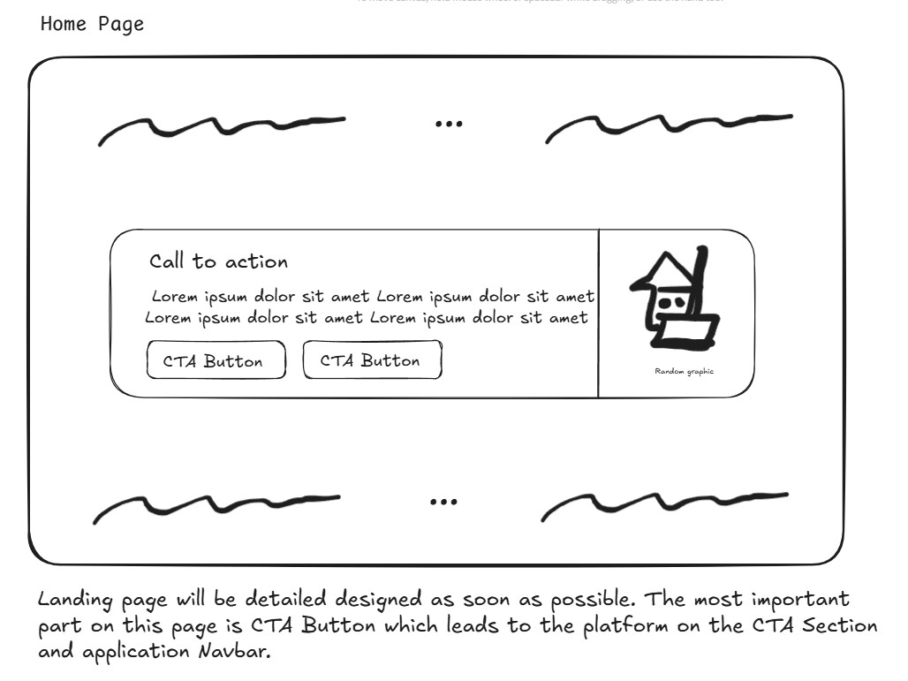


## 4.2. Register Page [#2](https://github.com/AndNijaz/cleanme-issues/issues/2)
The register page consists of a toggle switch to determine whether the person registering is a user or a cleaner. The form includes:
- **Email**
- **Password**
- **Confirm Password**
- Show passwords checkbox
- Link to terms and conditions
- Link to login page

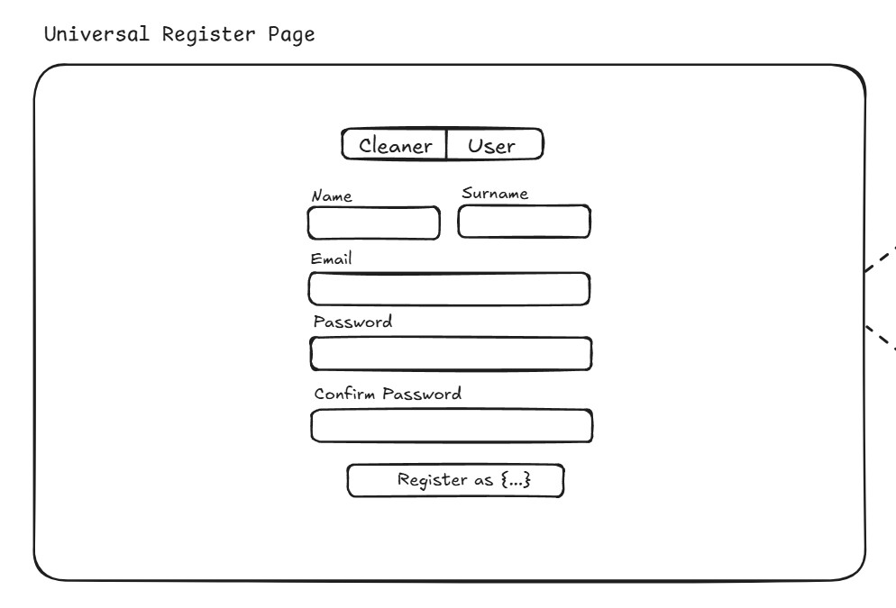
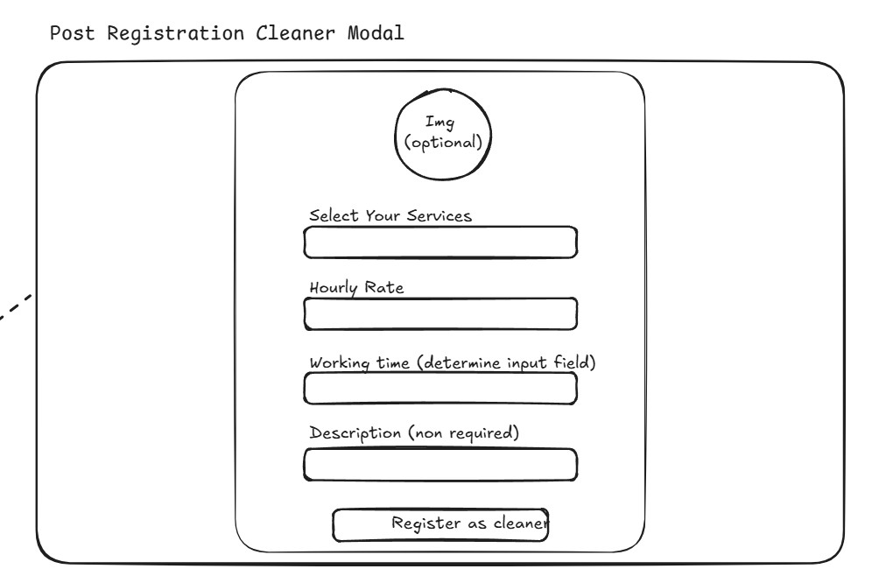


## 4.3. Login Page [#3](https://github.com/AndNijaz/cleanme-issues/issues/3)
The login page contains a form with:
- **Email**
- **Password**
- Eye icon for password visibility toggle
- "Remember me" checkbox
- Links to terms and conditions and the registration page

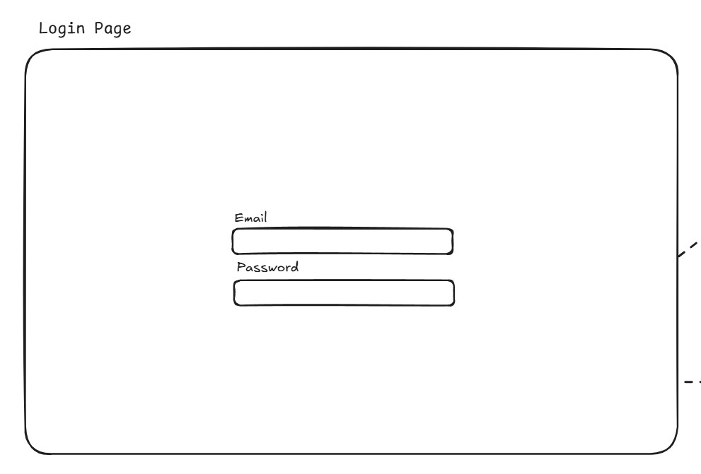

## 4.4. Dashboard Page [#4](https://github.com/AndNijaz/cleanme-issues/issues/4)
### User Dashboard
- Allows users to browse available cleaners and book services.
- **Components:**
  - Filters (services, working hours, location, saved listing, price)
  - Sorting by price
  - Cleaner cards with profile info, services, and prices
  - "Hire Now" button
  - Navigation to Cleaner Page for details

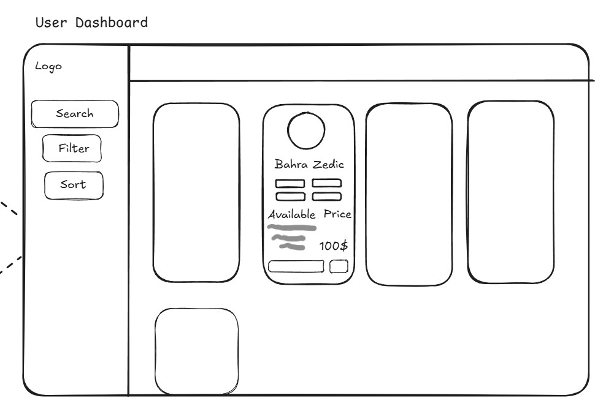

### Cleaner Dashboard
- Enables cleaners to manage bookings and update their profile.
- **Components:**
  - Active request list with accept/decline options
  - Notifications for new requests
  - First login modal to set up profile:
    - Profile picture (optional)
    - Description (optional)
    - Services offered
    - Hourly rates
    - Working hours
  - Disclaimer if profile setup is incomplete

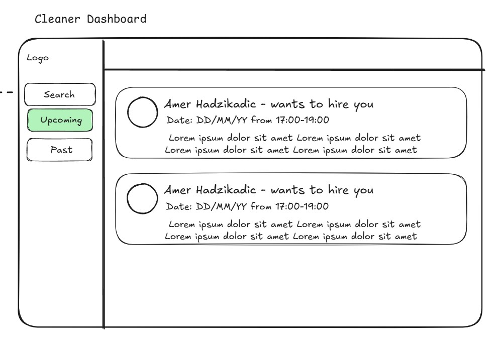

## 4.5. Profile Page [#5](https://github.com/AndNijaz/cleanme-issues/issues/5)
Displays user or cleaner details, with editable components:
- **Profile picture**
- **First & last name**
- **Cleaner-only details:**
  - Description
  - Available services as tags
  - Hourly rate

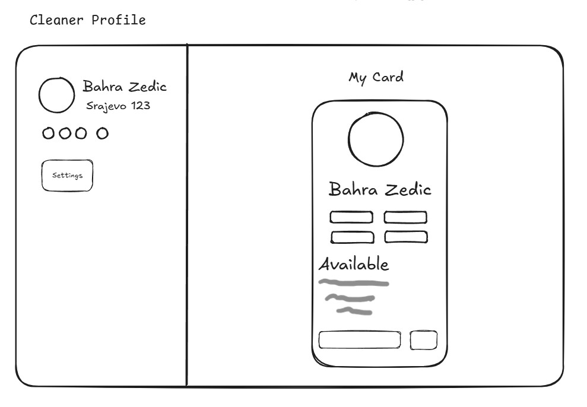
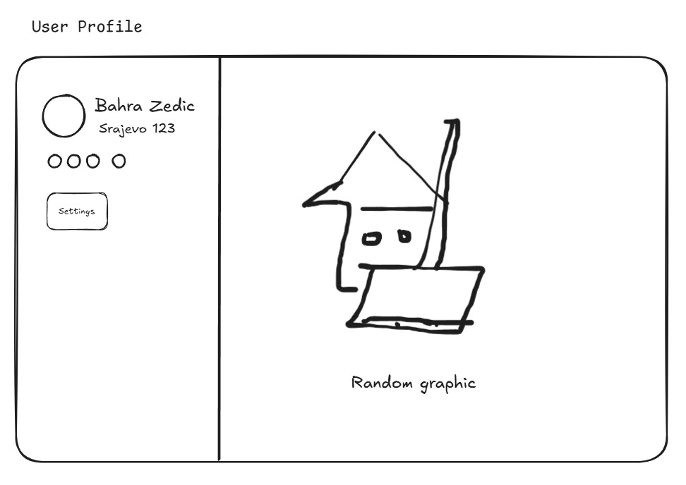

## 4.6. Cleaner Page [#6](https://github.com/AndNijaz/cleanme-issues/issues/6)
Dynamic page displaying cleaner details:
- **Profile picture**
- **Description**
- **Services (tags)**
- **Hourly rate**
- **"Hire Now" button** (booking)
- **"Save for Later" button** (favorites)
- Navigation to Service Reservation Page

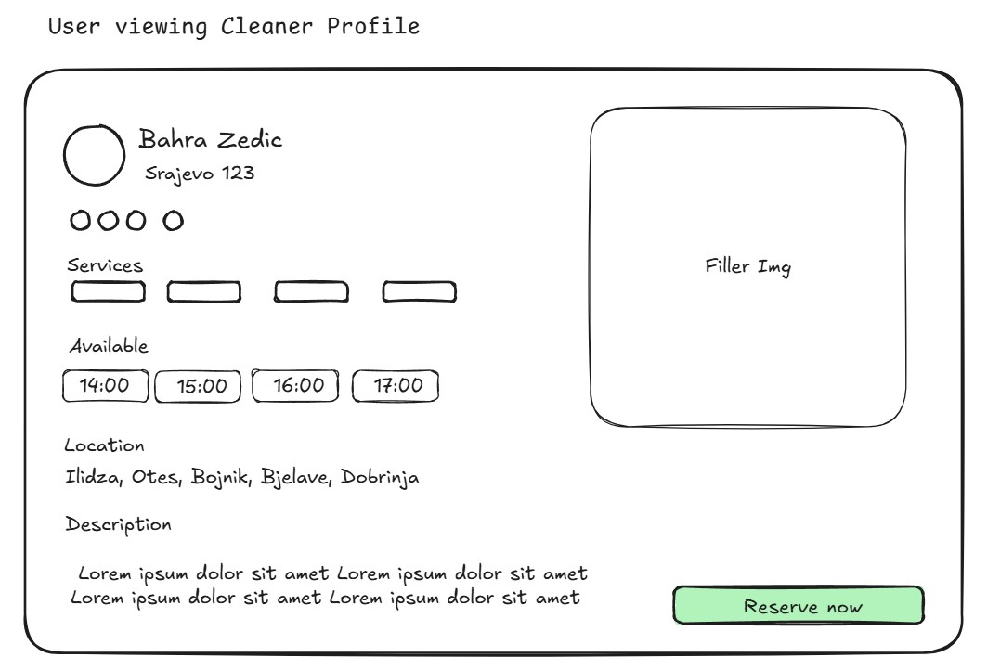

## 4.7. Service Reservation Page [#7](https://github.com/AndNijaz/cleanme-issues/issues/7)
Booking page for selecting time, location, and adding a comment.
- **Components:**
  - Calendar for selecting available slots
  - Location input field
  - Comment field
  - "Book Now" button

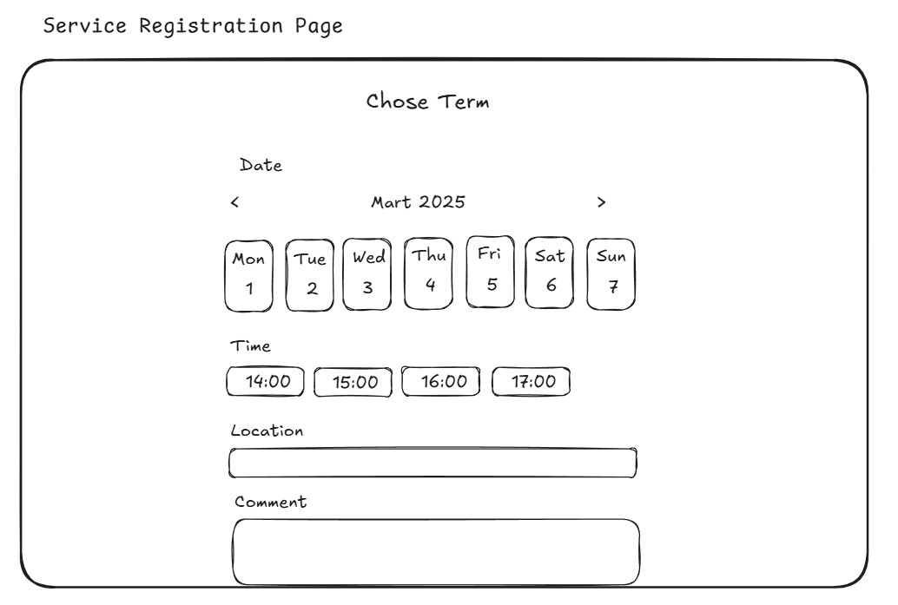

## 4.8. My Reservations Page [#8](https://github.com/AndNijaz/cleanme-issues/issues/8)
Page to view past and upcoming reservations.
- **Components:**
  - Reservation list with statuses (accepted, declined, pending)
  - Cancellation button (active until 3 days before appointment)
  - Chat button (active 3 days before appointment until completion)
  - Navigation to Live Chat Page

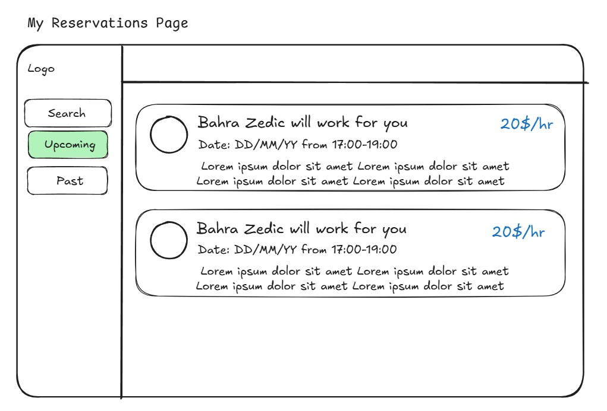

## 4.9. TO BE DONE: Live Chat Page [#9](https://github.com/AndNijaz/cleanme-issues/issues/9)
Direct communication page, available 3 days before the appointment until its completion.
- **Components:**
  - Chat window
  - "Send Message" button

## 4.10. Notification Page [#10](https://github.com/AndNijaz/cleanme-issues/issues/10)
Displays all booking and rating-related notifications.
- **Components:**
  - Notification list with statuses
  - Bell icon in navbar displaying new notifications count

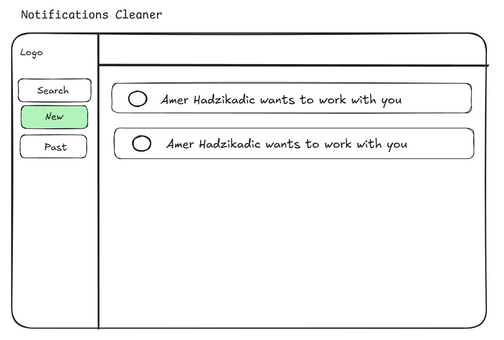
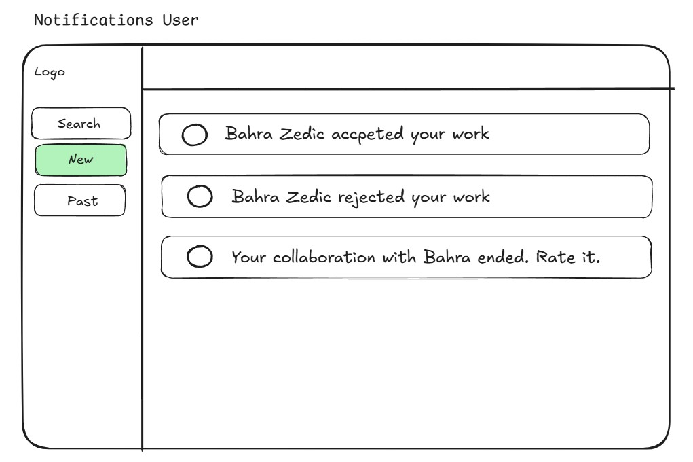

## 4.11. Rating & Reviews Modal [#11](https://github.com/AndNijaz/cleanme-issues/issues/11)
Modal for clients to rate cleaners after service completion.
- **Components:**
  - Rating input (1-5 stars)
  - Review text field
  - "Submit Rating" button

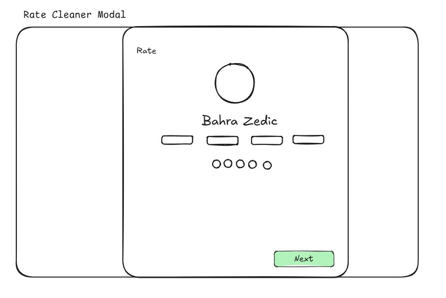

## 4.12. Terms & Conditions Page [#12](https://github.com/AndNijaz/cleanme-issues/issues/12)
Displays the app's terms of use.
- **Components:**
  - Text content of terms and conditions
  - "I Accept the Terms and Conditions" button


## 4.13. Navigation Bar Component [#13](https://github.com/AndNijaz/cleanme-issues/issues/13)
Global component for navigation.

### User Navbar:
- **Home** → Home Page
- **Dashboard** → User Dashboard
- **My Reservations** → Reservations Page
- **Bell icon** → Notifications Page
- **Profile** → User Profile Page

### Cleaner Navbar:
- **Home** → Home Page
- **Dashboard** → Cleaner Dashboard
- **Bell icon** → Notifications Page
- **Profile** → Cleaner Profile Page

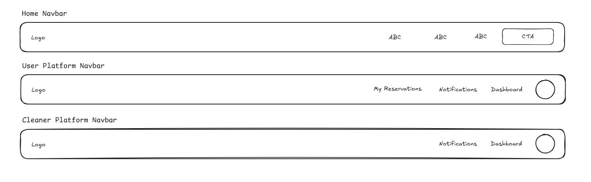

## 5. API Documentation
### CRUD Operations
| #   | CRUD    | URL Path                         | Request           | Response                  | Description                          |
|-----|---------|----------------------------------|-------------------|---------------------------|--------------------------------------|
| 1   | Create  | `/user/register`                | `UserDto`         | `UserDto`                 | Creates a new user                  |
| 2   | Create  | `/user/login`                   | `LoginDto`        | `TokenDto`                | User authentication                 |
| 3   | Read    | `/user/{id}`                    | `-`               | `UserDto`                 | Retrieves user information          |
| 4   | Update  | `/user/{id}`                    | `UserDto`         | `UserDto`                 | Updates user profile                |
| 5   | Read    | `/cleaners`                     | `-`               | `List<CleanerDto>`        | Retrieves list of cleaners          |
| 6   | Read    | `/cleaners/{id}`                | `-`               | `CleanerDto`              | Retrieves cleaner details           |
| 7   | Update  | `/cleaners/{id}`                | `CleanerDto`      | `CleanerDto`              | Updates cleaner profile             |
| 8   | Read    | `/cleaners/filter`              | `FilterDto`       | `List<CleanerDto>`        | Filters cleaners based on criteria  |
| 9   | Read    | `/cleaners/{id}/reservations`   | `-`               | `List<ReservationDto>`    | Retrieves all reservations for a cleaner |
| 10  | Update  | `/cleaners/{id}/reservations/{resId}` | `ReservationDto`  | `ReservationDto` | Updates specific reservation for cleaner |
| 11  | Create  | `/reservations`                 | `ReservationDto`  | `ReservationDto`          | Creates a new reservation           |
| 12  | Read    | `/reservations/my`              | `-`               | `List<ReservationDto>`    | Retrieves user's reservations       |
| 13  | Read    | `/reservations/{id}`            | `-`               | `ReservationDto`          | Retrieves reservation details       |
| 14  | Update  | `/reservations/{id}`            | `ReservationDto`  | `ReservationDto`          | User updates a reservation          |
| 15  | Delete  | `/reservations/{id}`            | `-`               | `-`                       | Universal cancel (user & cleaner)   |
| 16  | Read    | `/notifications/{id}`           | `-`               | `List<NotificationDto>`   | Retrieves all notifications for a user or cleaner |
| 17  | Create  | `/review/{reservationId}`       | `ReviewDto`       | `ReviewDto`               | Adds a review after service completion |
| 18  | Read    | `/review/cleaner/{cleanerId}`   | `-`               | `List<ReviewDto>`         | Displays all reviews for a cleaner |
| 19  | Create  | `/chat/{reservationId}`         | `MessageDto`      | `MessageDto`              | Creates a new chat message |
| 20  | Read    | `/chat/{reservationId}`         | `-`               | `List<MessageDto>`        | Retrieves all messages for a specific booking |
| 21  | Delete  | `/chat/{reservationId}`         | `-`               | `-`                       | Deletes all chat messages for a specific booking |
| 22  | Read    | `/terms-and-conditions`         | `-`               | `String`                  | Retrieves terms and conditions      |


### Data Transfer Objects
```ts
UserDto
{
  id: string, 
  firstName: string,
  lastName: string,
  email: string,
  userType: string,
}
```
```ts
LoginDto
{
  email: string,
  password: string
}
```
```ts
TokenDto
{
  accessToken: string,
  refreshToken: string
}
```
```ts
CleanerDto
{
  id: string,
  userId: string,
  services: array,
  hourlyRate: number,
  availability: string,
  description: string,
  profilePicture: string
}
```
```ts
FilterDto
{
  location: string,
  minRate: number,
  maxRate: number,
  availability: string
}
```
```ts
ReservationDto
{
  id: string,
  userId: string,
  cleanerId: string,
  date: string,
  time: string,
  location: string,
  status: string,
  comment: string
}
```
```ts
MessageDto
{
  id: string,
  reservationId: string,
  senderId: string,
  message: string,
  timestamp: string
}
```
```ts
ReviewDto
{
  id: string,
  reservationId: string,
  cleanerId: string,
  userId: string,
  rating: number,
  comment: string,
  date: string
}
```
```ts
NotificationDto
{
  id: string,
  userId: string,
  message: string,
  timestamp: string,
  read: boolean
}
```

## 6. Technical Requirements
CleanMe is built using the following technologies:
- Backend: Java, Spring, PostgreSQL 
- Frontend: Angular 

The app Frontend/Backend is hosted on a NETLIFY/AWS cloud server respectively.


## 7. Out of Scope
The following functionalities are not planned for the initial version of the app:

- **In-app Payments** – Payments through the app are not yet supported (possible in future versions). [#14](https://github.com/AndNijaz/cleanme-issues/issues/14)
- **Cleaner Comparison Page** – The functionality for comparing cleaners has not been defined yet. [#15](https://github.com/AndNijaz/cleanme-issues/issues/15)
- **Advanced Scheduling Features** – Automatic scheduling based on user preferences is not currently planned. [#16](https://github.com/AndNijaz/cleanme-issues/issues/16)
- **Mobile App Version** – In the initial phase, the app will be available only as a web platform. [#17](https://github.com/AndNijaz/cleanme-issues/issues/17)
- **Referral & Loyalty Programs** – Reward programs for users and cleaners are not included in the first version. [#18](https://github.com/AndNijaz/cleanme-issues/issues/18)
- **AI-powered Matching** – Intelligent matching of cleaners and users based on usage history and reviews is not currently planned. [#19](https://github.com/AndNijaz/cleanme-issues/issues/19)
