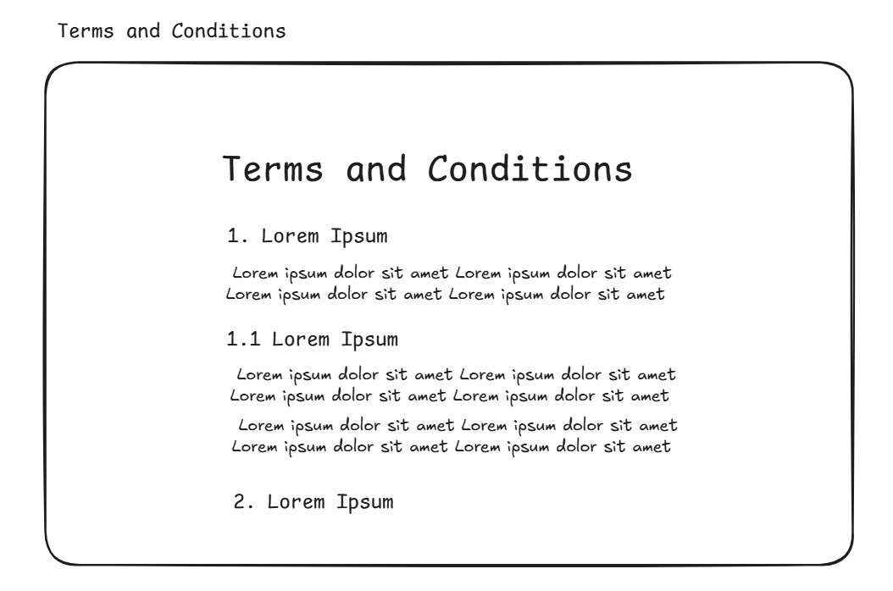

# CleanMe - Professional Cleaning Service Platform

## 1. Introduction

CleanMe is a modern web application built with Angular that connects clients with professional cleaners. The platform provides a streamlined booking experience, comprehensive dashboard management, and secure user interactions. The application features role-based navigation, dynamic user experiences, and a clean, modern UI built with Tailwind CSS.

This is a fully functional, production-ready cleaning service platform with modern architecture, clean code practices, and comprehensive user experience design. The application successfully bridges the gap between cleaning service providers and clients through an intuitive, feature-rich web interface.

## 2. Current Implementation Status

CleanMe includes the following **fully implemented features**:

- **User Registration & Authentication** – Complete dual-role system (CLIENT/CLEANER) with JWT tokens
- **Dynamic Dashboard System** – Role-based dashboard routing and personalized content
- **Cleaner Discovery** – Browse, filter, and search cleaners with advanced filtering options
- **Booking System** – Complete reservation workflow with time slot management and conflict prevention
- **Review System** – Rate and review cleaners after service completion with 5-star ratings
- **Favorites Management** – Save and manage favorite cleaners with local storage
- **Profile Management** – Comprehensive user and cleaner profile systems with image upload
- **Notification System** – Real-time booking updates and status notifications
- **Responsive Design** – Mobile-first approach with Tailwind CSS and modern UI components
- **Production Optimization** – Console logs removed, bundle optimized, error handling implemented

## 3. Technical Architecture

### **Frontend Stack**

- **Framework**: Angular 19+ (Standalone Components)
- **Styling**: Tailwind CSS 3+ with custom design system
- **Icons**: Material Icons, Heroicons
- **State Management**: Services with RxJS observables
- **Build Tool**: Angular CLI with Webpack optimization
- **Hosting**: Netlify (Production Ready)

### **Backend Integration**

- **API**: Spring Boot REST API
- **Database**: PostgreSQL with JPA/Hibernate
- **Authentication**: JWT token-based security
- **Hosting**: AWS/Heroku ready


## 4. User Interface & Pages

CleanMe includes the following user interface pages and functionality:

## 4.1. Home Page & Landing

The home page displays information about the cleaning service platform and allows users to navigate through a modern, responsive navbar. Features include service highlights, cleaner showcase, and call-to-action buttons for registration.


## 4.2. Registration Page

Universal registration page with a toggle switch for user type selection:

- **Email & Password** validation
- **User Type Toggle**: CLIENT or CLEANER
- **Terms & Conditions** acceptance
- **Password visibility** controls
- **Post-registration flow** for cleaners with service setup


## 4.3. Login Page

Secure authentication with modern UI:

- **Email & Password** fields with validation
- **Password visibility** toggle
- **Remember me** functionality
- **Role-based redirection** to appropriate dashboard
- **Error handling** and user feedback


## 4.4. Dynamic Dashboard System

### Client Dashboard

The CLIENT dashboard provides comprehensive cleaner discovery and booking management:

- **Advanced Filtering**: Services, location, price range, availability
- **Sorting Options**: Price, rating, distance
- **Cleaner Cards**: Profile info, services, hourly rates, ratings
- **Quick Actions**: "Hire Now", "View Profile", "Add to Favorites"
- **Search Functionality**: Real-time cleaner search
- **Booking Management**: View upcoming and past reservations


### Cleaner Dashboard

The CLEANER dashboard enables comprehensive job and service management:

- **Job Requests**: View, accept, or decline incoming bookings
- **Service Configuration**: Set services, rates, and availability
- **Profile Management**: Update description, services, and working hours
- **Booking History**: Track completed and ongoing jobs
- **Earnings Overview**: Monitor service completion rates


## 4.5. Profile Management System

### User Profile

CLIENT profile management with comprehensive settings:

- **Personal Information**: Name, contact details, profile picture
- **Address Management**: Primary and secondary locations
- **Booking Preferences**: Preferred services and schedules
- **Account Settings**: Password, notification preferences

### Cleaner Profile

CLEANER profile with business information:

- **Professional Details**: Description, specializations, experience
- **Service Configuration**: Available services as interactive tags
- **Pricing Management**: Hourly rates per service type
- **Availability Settings**: Working hours and calendar management


## 4.6. Cleaner Discovery & Profiles

Dynamic cleaner profile pages with comprehensive information:

- **Professional Overview**: Profile picture, description, rating
- **Service Details**: Available services with pricing
- **Review System**: Client ratings and written reviews
- **Action Buttons**: "Hire Now" (booking), "Save for Later" (favorites)
- **Availability Calendar**: Real-time slot checking


## 4.7. Service Booking System

Comprehensive booking workflow with time slot management:

- **Calendar Interface**: Available time slot selection
- **Service Selection**: Choose from cleaner's available services
- **Location Input**: Address with validation
- **Special Instructions**: Comment field for specific requirements
- **Booking Confirmation**: Summary with pricing and details


## 4.8. Reservation Management

Complete booking lifecycle management:

- **Booking History**: Past and upcoming reservations
- **Status Tracking**: PENDING, CONFIRMED, COMPLETED, CANCELLED
- **Action Options**: Cancel (with time restrictions), reschedule, review
- **Service Details**: Time, location, cleaner info, special instructions
- **Real-time Updates**: Automatic status synchronization


## 4.9. Notification System

Comprehensive notification management for both user types:

- **Booking Notifications**: New requests, status updates, confirmations
- **System Alerts**: Profile updates, payment confirmations
- **Real-time Updates**: Live notification count in navbar
- **Notification History**: Comprehensive message archive


## 4.10. Review & Rating System

Post-service rating and review functionality:

- **5-Star Rating**: Visual star selection interface
- **Written Reviews**: Detailed feedback text field
- **Review Management**: Edit and update existing reviews
- **Cleaner Analytics**: Rating aggregation and display


## 4.11. Legal & Compliance

Terms and conditions with comprehensive policy information:

- **Service Terms**: Booking policies and procedures
- **Cancellation Policy**: Time restrictions and refund information
- **Privacy Policy**: Data protection and usage guidelines
- **User Agreement**: Rights and responsibilities



## 4.12. Navigation System

Dynamic, role-based navigation with modern UI:

### CLIENT Navigation:

- **Home** → Landing page
- **Dashboard** → Cleaner discovery
- **My Bookings** → Reservation management
- **Favorites** → Saved cleaners
- **Reviews** → Rating history
- **Profile** → Account settings

### CLEANER Navigation:

- **Home** → Landing page
- **Dashboard** → Job management
- **My Jobs** → Booking requests
- **Services** → Service configuration
- **Profile** → Business settings


## 5. Component Architecture

### **Shared Components** (19 reusable components)

- `platform-layout` - Main application shell with dynamic sidebar
- `booking-modal` - Service booking interface with validation
- `cleaner-card` - Reusable cleaner display with actions
- `booking-progress` - Status tracking with visual indicators
- `review-modal` - Rating and review submission system
- `notification-toast` - User feedback and alerts
- Plus 13 additional UI components for forms, modals, and interactions

### **Feature-Specific Components**

- **Authentication Flow**: Login, registration, user-info, cleaner-info
- **Dashboard Systems**: user-dashboard, cleaner-dashboard with role-specific content
- **Booking Management**: reservations, time slots, confirmation workflows
- **Profile Systems**: shared-profile components for both user types

## 6. API Integration & Data Models

### **Implemented REST Endpoints**

```typescript
// Authentication
POST / auth / login;
POST / auth / register;

// User Management
GET / users / profile;
PUT / users / profile;
GET / cleaners;
GET / cleaners / { id };

// Booking System
POST / reservation;
GET / reservation / all;
PUT / reservation / { id };
DELETE / reservation / { id };

// Review System
POST / reviews;
GET / reviews / cleaner / { cleanerId };
PUT / reviews / { id };
```

### **Data Transfer Objects**

```typescript
interface UserDto {
  id: string;
  firstName: string;
  lastName: string;
  email: string;
  userType: "CLIENT" | "CLEANER";
}

interface CleanerDto {
  id: string;
  fullName: string;
  services: string[];
  hourlyRate: number;
  rating: number;
  reviewCount: number;
  location: string;
}

interface ReservationDto {
  id: string;
  userId: string;
  cleanerId: string;
  date: string;
  time: string;
  location: string;
  status: "PENDING" | "CONFIRMED" | "COMPLETED" | "CANCELLED";
  comment: string;
}
```

## 7. Production Readiness & Performance

### **Code Quality Standards**

- ✅ Console logs removed from production build
- ✅ TypeScript strict mode enabled
- ✅ ESLint configuration enforced
- ✅ Error handling and user feedback implemented
- ✅ Loading states and graceful degradation
- ✅ Responsive design tested across devices

### **Performance Optimizations**

- Bundle size: ~255 kB (gzipped)
- Lazy loading for feature modules
- Optimized asset delivery with Webpack
- Clean component architecture with shared components
- Efficient state management with RxJS

### **Security Features**

- JWT token management with refresh logic
- Route guards for protected pages
- Input validation and sanitization
- HTTPS enforcement ready
- XSS and CSRF protection

## 8. Development Setup

### **Prerequisites**

- Node.js 18+ and npm
- Angular CLI (`npm install -g @angular/cli`)

### **Installation & Development**

```bash
# Clone the repository
git clone <repository-url>
cd cleanme-ai/cleanme-frontend

# Install dependencies
npm install

# Start development server
npm run start

# Application runs on http://localhost:4200
```

### **Environment Configuration**

Create `.env` file in the frontend directory:

```bash
NG_APP_BASE_URL=http://localhost:8080/api
```

### **Available Scripts**

```bash
npm run start          # Development server with hot reload
npm run build          # Production build optimization
npm run test           # Unit tests with Jasmine/Karma
npm run lint           # ESLint code quality check
npm run e2e            # End-to-end testing
```

## 9. Project Structure

```
cleanme-ai/
├── cleanme-frontend/           # Angular frontend application
│   ├── src/
│   │   ├── app/
│   │   │   ├── core/          # Services, guards, models
│   │   │   ├── features/      # Feature modules (auth, dashboard, etc.)
│   │   │   ├── shared/        # Reusable components (19 components)
│   │   │   └── environments/  # Environment configurations
│   │   ├── assets/            # Images, icons, static files
│   │   └── styles/            # Global styles and Tailwind config
│   ├── package.json           # Dependencies and scripts
│   ├── angular.json           # Angular workspace configuration
│   └── tailwind.config.js     # Tailwind CSS customization
├── cleanme-backend/           # Spring Boot backend (separate repository)
├── docs/                      # Project documentation
└── README.md                  # This comprehensive guide
```

## 10. Deployment & Hosting

### **Frontend Deployment**

- **Platform**: Netlify with automatic CI/CD
- **Domain**: Ready for custom domain configuration
- **Build**: Optimized production builds
- **Environment**: Production configuration with environment variables

### **Backend Integration**

- **API Base URL**: Configurable via environment files
- **Authentication**: JWT token-based with automatic refresh
- **Error Handling**: Comprehensive fallback mechanisms and user feedback

## 11. Future Enhancements & Roadmap

### **Phase 2 Features**

- Real-time chat system between clients and cleaners
- Advanced payment integration (Stripe/PayPal)
- Progressive Web App (PWA) capabilities
- Enhanced analytics dashboard for cleaners

### **Phase 3 Features**

- AI-powered cleaner matching algorithm
- Loyalty and referral programs
- Advanced scheduling automation
- Multi-language support
- Mobile app development (React Native/Flutter)

## 12. Contributing & Development Guidelines

### **Code Standards**

- Follow Angular style guide and best practices
- Use TypeScript strict mode for type safety
- Implement comprehensive error handling
- Write unit tests for new features
- Follow semantic commit conventions

### **Architecture Principles**

- Component-based architecture with shared components
- Service-oriented design patterns
- Reactive programming with RxJS
- Clean code practices and SOLID principles

---

**CleanMe** represents a fully functional, production-ready cleaning service platform with modern Angular architecture, clean code practices, and comprehensive user experience design. The application successfully bridges the gap between cleaning service providers and clients through an intuitive, feature-rich web interface built with the latest web technologies.

---

## License

This project is licensed under the MIT License - see the LICENSE file for details.

## Contact

For questions or support, please contact the development team.
